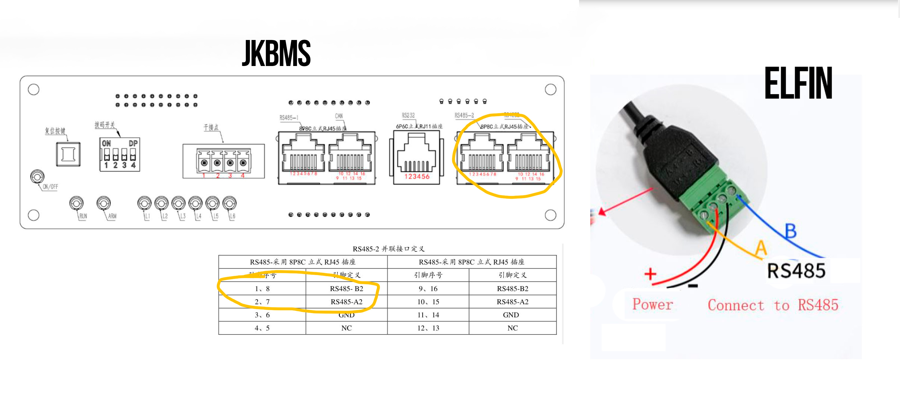

JKBMS MQTT
=============

Python script to connect a battery pack using BMS JK-BMS to MQTT

Connect a USB to RS485 to any RS485 free port in your JKBMS.
MQTT also provides Home Assistant auto discovery


Quick start
-------------

Clone the repository on your PC
```text
git clone https://github.com/luisgonzalezgonzalez/jkbms_mqtt.git
cd jkbms_mqtt
```

Adapt the variables in the docker-compose.yaml. Then build the image and start with docker-compose:

```text
sudo docker build -t jkbms-mqtt .
sudo docker-compose up -d
```


Use dockerhub image integrae/jkbms-mqtt:latest

Documentation
-------------

```text
Usage:  
  python jkbms.py 

INI file:  
[jkbms]
mqtt_server = mqtt server address
mqtt_port = mqtt server port
mqtt_user = mqtt username
mqtt_pass = mqtt password
mqtt_topic = topic to publis

modbus_ip = ip from modbus to wifi/ethernet adapter
modbus_port = 502
modbus_unit = (Id of battery)

query_seconds = (every request in seconds)

homeassistant_mqtt_topic = homeassistant
debug_values = false (debug values)
```

How-to video - In Spanish
-------------------------

[](https://youtu.be/O0Yg4UXV4d0 "Home Assistant + JK BMS: Monitorea tu batería fácilmente")

Pinout and Wiring
-----------------




Project Informations
--------------------


### - License

### - Release Note

* 1.0.0 First release

Disclaimer
----------

THE SOFTWARE IS PROVIDED "AS IS", WITHOUT WARRANTY OF ANY KIND, EXPRESS OR IMPLIED, INCLUDING BUT NOT LIMITED TO THE WARRANTIES OF MERCHANTABILITY, FITNESS FOR A PARTICULAR PURPOSE AND NONINFRINGEMENT.
IN NO EVENT SHALL THE AUTHORS OR COPYRIGHT HOLDERS BE LIABLE FOR ANY CLAIM, DAMAGES OR OTHER LIABILITY, WHETHER IN AN ACTION OF CONTRACT, TORT OR OTHERWISE, ARISING FROM, OUT OF OR IN CONNECTION WITH THE SOFTWARE OR THE USE OR OTHER DEALINGS IN THE SOFTWARE.

